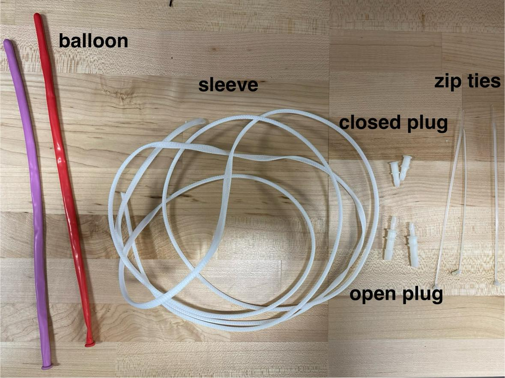
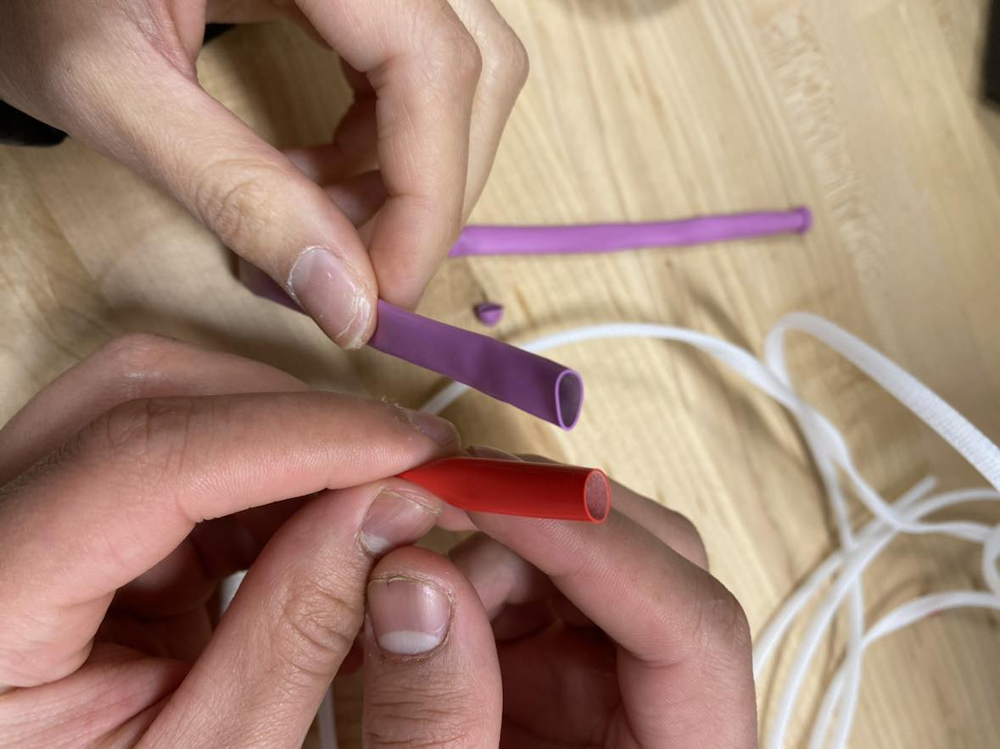
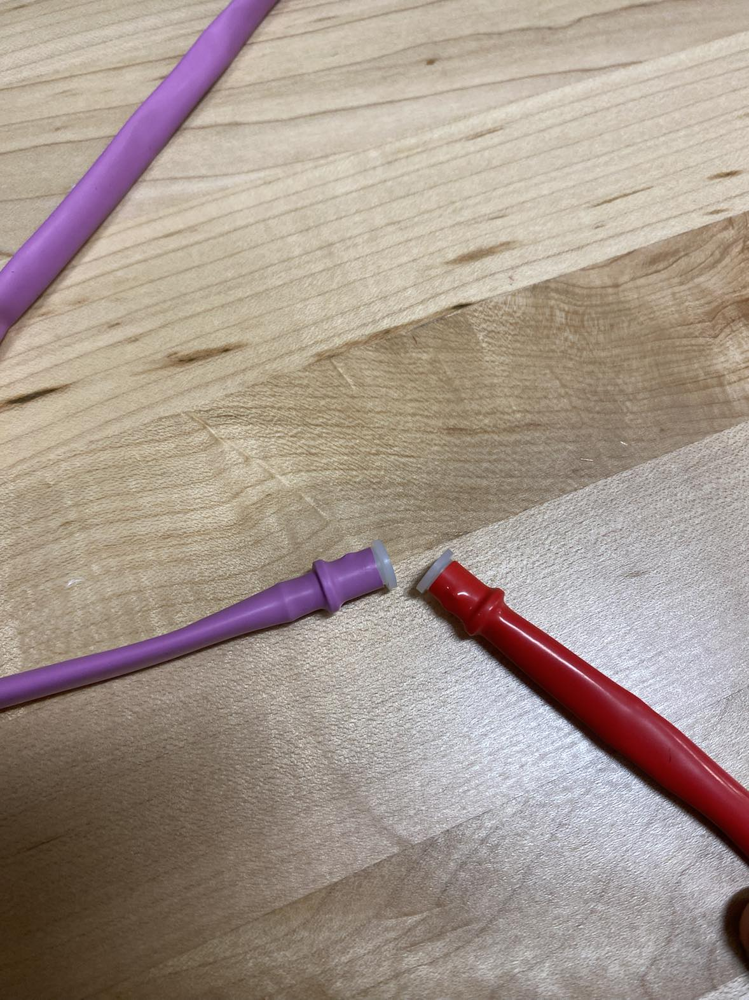
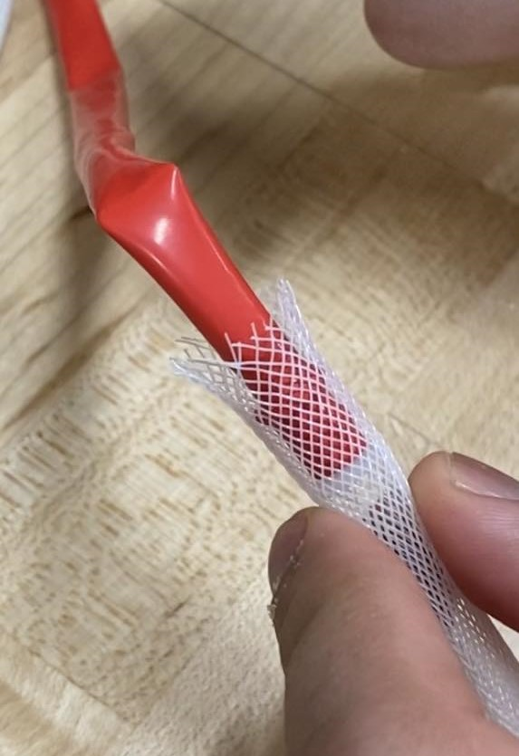
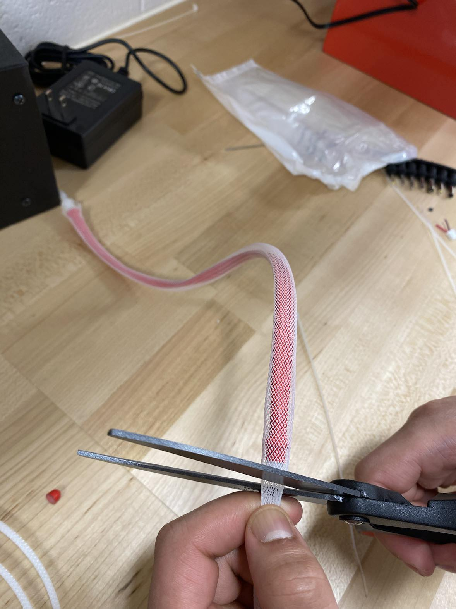
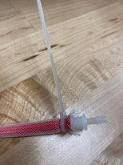
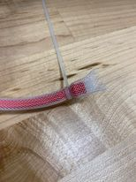
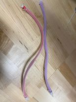

## Instruction for making balloon sleeve

Materials for 1 balloon sleeve:
- 1 Balloon
- 1 Sleeve
- 1 Open plug (shorter)
- 1 Closed plug (longer)
- 2 zip ties 

1. Insert the open plug into the balloon’s lip 

2. Cut open the closed end of the balloon 

3. Insert the closed plug all the way up 

4. Start inserting the closed plug end into the sleeve and push it through until the entire balloon is inside the sleeve

5. Cut the sleeve (leave a little excess to zip tie later)

6. Zip tie both ends as tight as possible and cut the excess zip tie

7. The final product should look like this

