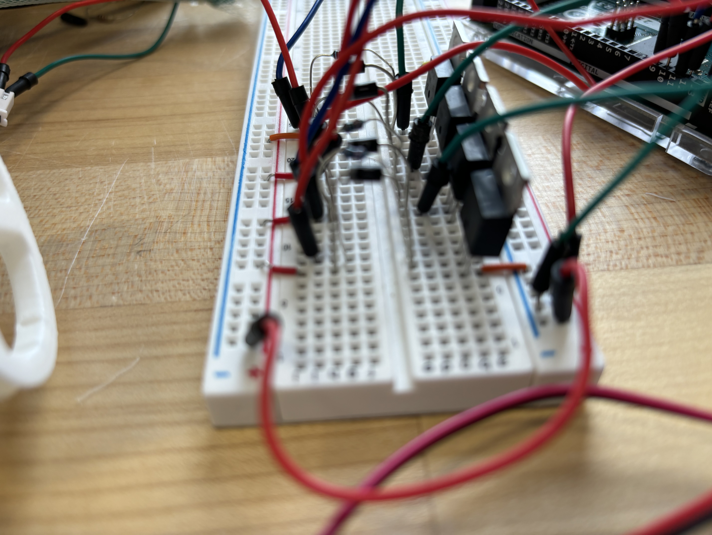
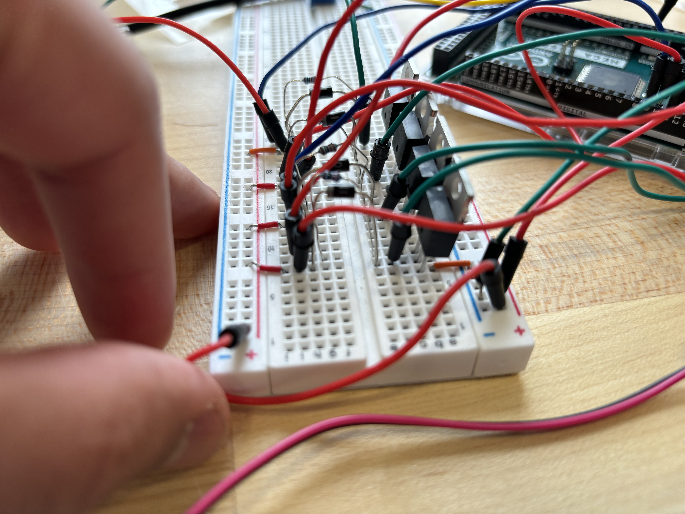
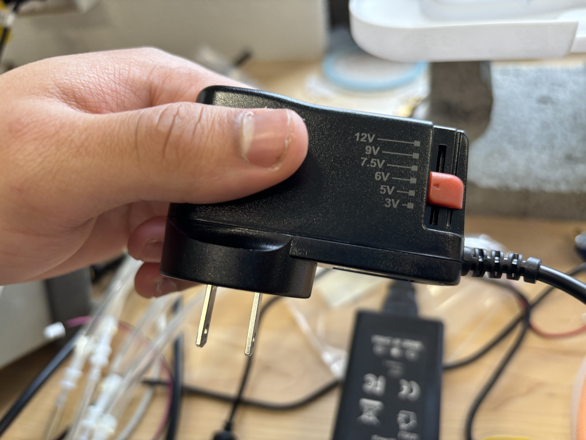
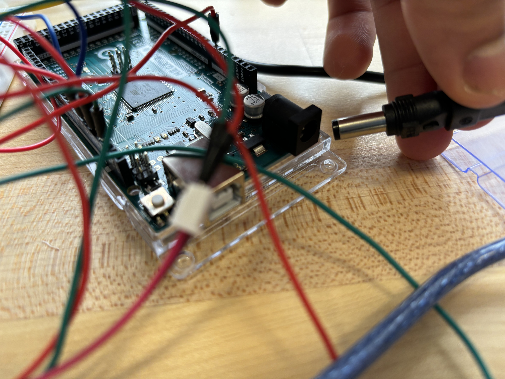

This is a tutorial on how to use the pneumatic board when testing using arm straps
1. 
To ensure that the solenoid works functionally, first we want to plug in the red and green wires connected to the solenoid into the board. 

The green wire should be plugged in to the right side of the board, in between the snubber diode and the transistor. The red wire should be plugged in to the left side of the board, right next to the left side of the snubber diode. 

2. 
Ensure that the power supply is set to release 6V. 

3. 
Plug the power into the Arduino Mega.

