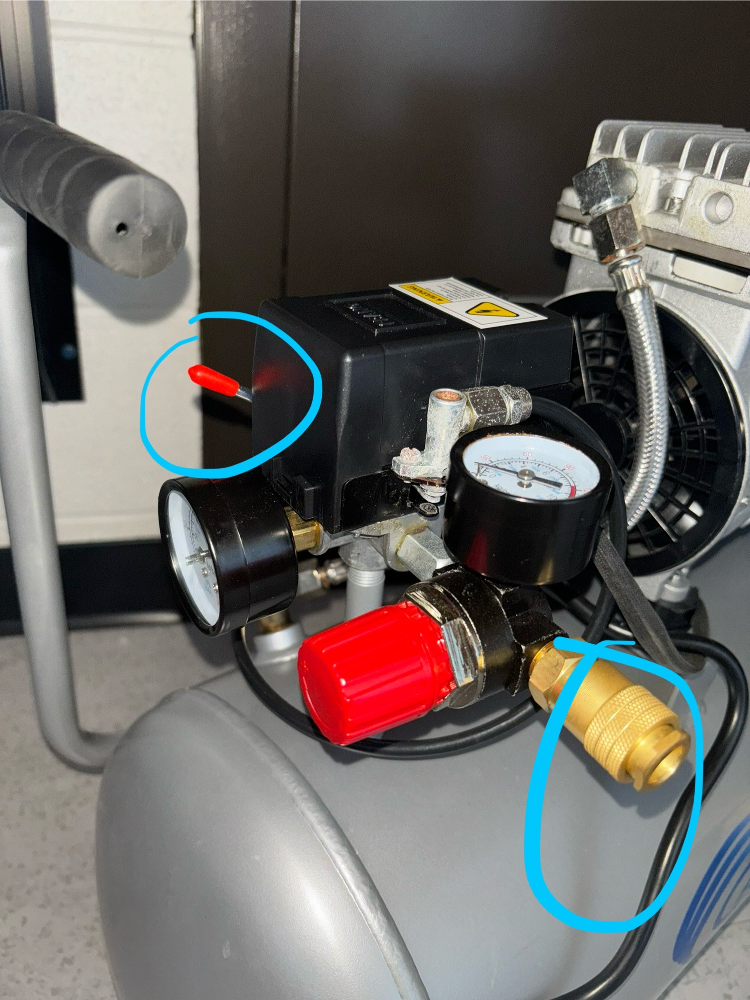
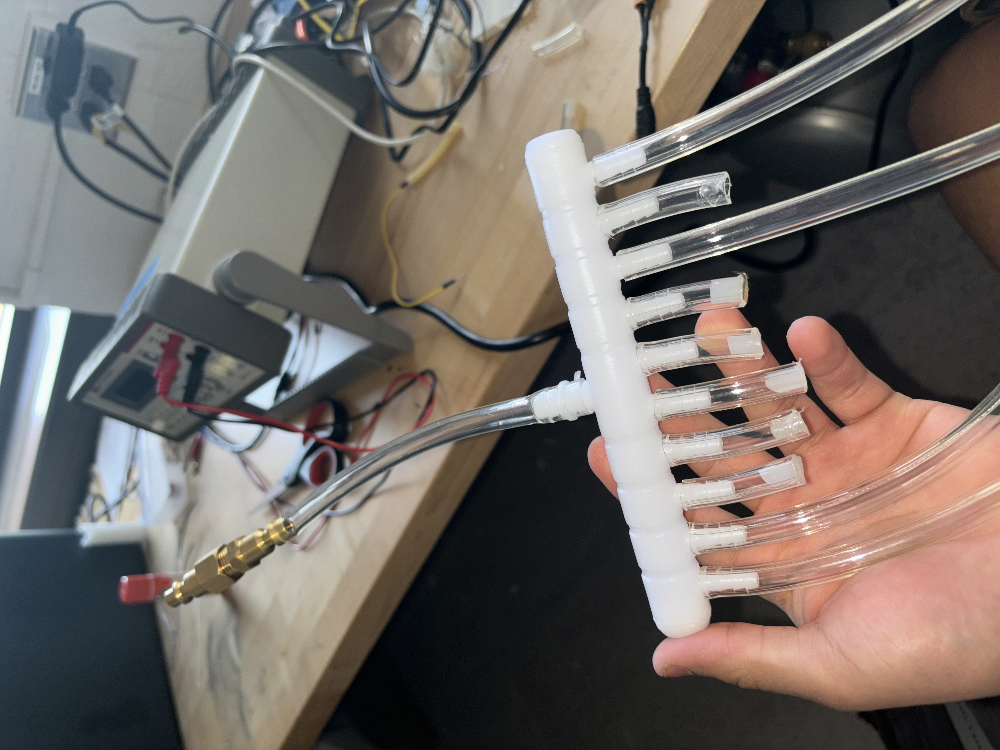
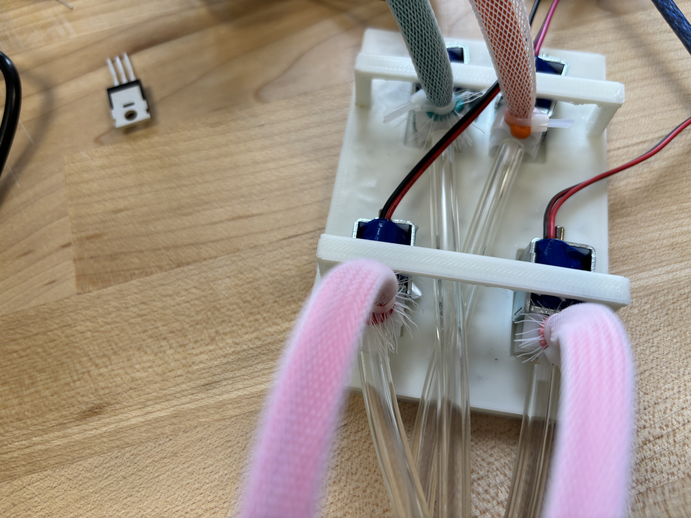
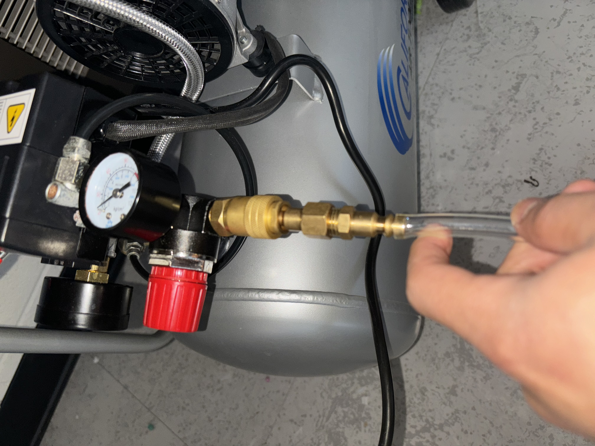
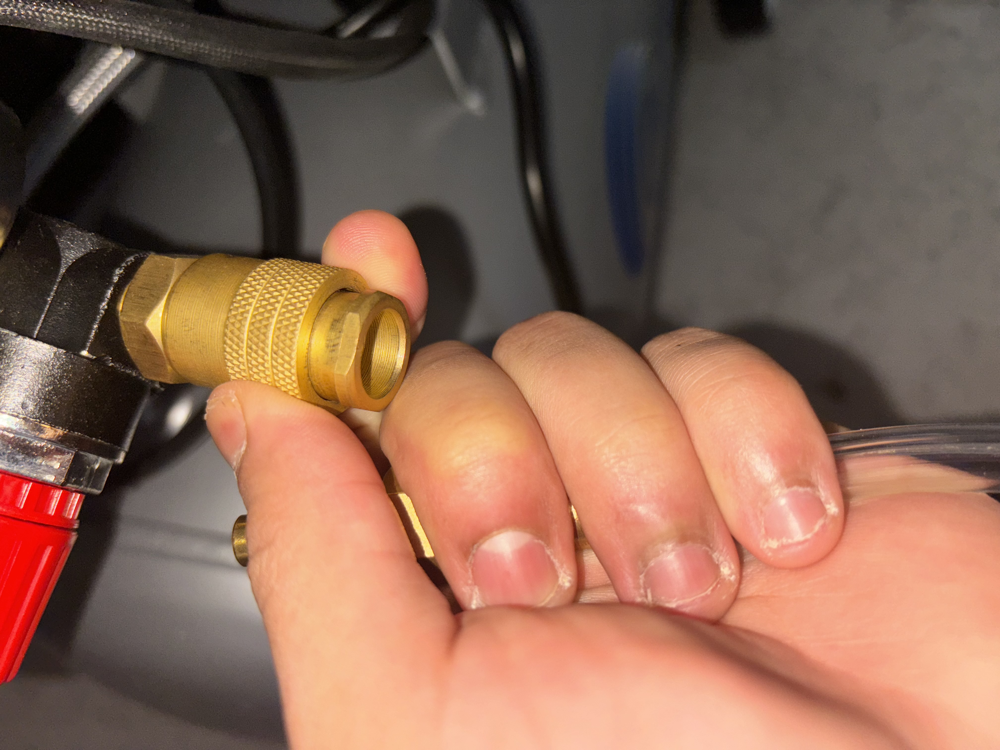

This is a tutorial on how to use the pneumatic board when testing using arm straps

THE ARDUINO BOARD
1. 
To ensure that the solenoid works functionally, first we want to plug in the red and green wires connected to the solenoid into the board. 

The green wire should be plugged in to the right side of the board, in between the snubber diode and the transistor. The red wire should be plugged in to the left side of the board, right next to the left side of the snubber diode. 

2. 
Ensure that the power supply is set to release 7.5V. 

3. 
Plug the power into the Arduino Mega.

4. Once the Arduino is plugged in, turn the blue dial to increase or decrease the rate at which the air is being released to the balloon straps. This dial controls the rate at which the solenoid will open and close for airflow.

THE AIRPUMP

5. 

First, we want to ensure that the airpump is plugged into a power source. Once that is complete, there are two important parts to be aware of. The top circled part is to turn on the airpump. The bottom knozzle is to release the air into our board. To fill the pump with air, flip the top red switch on and let it fill. (I usually fill the pump up to 30kpa, for our current 4 tube model. However you may need more or less depending on your needs)

6. 

Take the air tube divider. Ensure that every output which will not be used is plugged so that no air is lost. Then ensure that the ones that will be used are plugged in correctly.

7. 

Now ensure that the tubes are correctly connected to the pneumatic board as shown in the image above. 

8. 

Plug our tube piece to the knozzle of the airpump. Once this is plugged in, air will immediately begin to flow out of the pump. Once air flows out, you can use the dials to control the airflow into the balloons. Additionally, if you want more continouos airflow, you can turn on the airpump again to fill it while its releasing air. (I've noticed that air will usually come in at a faster rate than it is let out, so beware of this)

9. 

Once finished, to unplug the tubing, pull on the knozzle as shown in the image. This will expel the tubing from the knozzle and stop the air flow. Additionally, if fully finished using the airpump, release the air from the bottom of the airpump using the small switch at the very bottom.

These are all the step to make the airpump/pneumatic board work. Update this document as we update our board.

Last updated: 4/30/2024
Christian Diaz Herrera